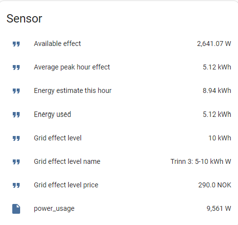

# Grid energy level tariff monitor

To English HA Users: As this integration only is relevent for Norwegian HA users, documentation is only available in norwegian for now.  Sorry!


## Beskrivelse
Denne integrasjonen setter opp en platform-entitet for å holde øye med effekt-data i forhold til å holde seg innenfor et effekt-trinn hos netteier.

Integrasjonen oppretter følgende sensorer:

## Generelle sensorer:

**Energy Used**

  Dette er en enkel rienmann left sum basert på input sensor, som nullstiller seg for hver klokketime.
  Input sensor i configuration.yaml må enten måle i W eller kW.  Sensoren angir forbruk i kWh for inneværende time.

**Energy estimate this hour**

  Estimert forbruk denne timen.  Estimatet regnes ut etter formelen (Energi Brukt) + (MomentanEffekt * Antall sekunder igjen i time)
  Eksempel:

```
  8 kWh brukt i løpet av de første 45 minuttene av timen.
  5000 W momentaneffekt.
  15 minutter er 900 sekund

  8 + (5000 * 900 / 3600 / 1000) = 9,25 kWh i estimat for timen.
```

  Sensoren angir data i kWh.

## Effekt-trinn sensorer:
**NB!** Disse sensorene baserer seg på at effekt-trinn regnes ut av snittet for de tre timene med høyest forbruk på tre forskjellige dager.
Inntil man har startet på dag 3 så vil nødvendigvis ikke disse sensorene gi riktige data.
For dag en så vil effekt-trinn sensorene vises basert på høyeste time kun på dag 1.
For dag to så vil effekt-trinn sensorene vises for snittet av dag 1 og 2.
Fra og med første time på dag 3 så vil sensorene vise riktig verdi.

**Grid effect level**

  Angir øvre terskelverdi basert på tre høyeste timer målt denne måneden, fra tre ulike dager.
  Sensoren angir data i kWh.  Eksempel: Dersom du befinner deg på effekt-trinn 5-10 kWh, så vil sensoren angi 10kWh

**Grid effect level name**

  Navn på effekt-trinn hentet fra konfigurasjonen.


**Grid effect level price**

  Pris på nåværende effekt-trinn.  Angis i NOK


**Average peak hour effect**

  Snittet på de tre høyeste timer fra tre forskjellige dager målt denne måneden.

**Available effect**

  Angir maks momentaneffekt man kan bruke resten av timen og holde seg innenfor det effekt-trinnet man er på.
  Sensoren har måleenhet på Watt.
  Regnes ut slik: (Terskelverdi_trinn - Energi brukt) / ( Antall sekunder igjen i time) - Momentaneffekt
  Eksempel:

```
    Effekttrinn 5-10 kWh.
    8 kWh brukt de første 45 minutt av timen.
    Momentaneffekt 5kW
    Sensoren vil da regne ut hvor mange watt man kan trekke de siste 15 minutt(900 sekunder) av timen, minus
    den momentaneffekten man allerede bruker.

    (10000 - 8000) * 1000 * 3600 / 900 - 5000 = 3000

    Sensoren vil angi at man resten av timen har 3000W effekt tilgjengelig i tillegg til det man allerede bruker.
```
Ett positivt tall på denne sensoren betyr at man kan forbruke mer effekt i gjenværende del av timen.

Negativt tall her betyr at man vil gå over effekt-trinnet dersom man opprettholder forbruket.


## Installasjon

Sensoren kan kun installeres en gang.  Installeres med å kopiere inn filene fra dette repositoryet, eller via HACS(anbefalt)

### Filkopiering

1.  Åpne mappen som inneholder din HA-konfiguration (`configuration.yaml`)
2.  Dersom du ikke har en mappe som heter `custom_components` så oppretter du den
3.  I mappen `custom_components` så lager du en ny mappe som heter `grid_energy_level`
4.  Last ned alle filene fra `custom_components/grid_energy_level/` i dette repositoryet, og plasser dem inne i `grid_energy_level`-mappen
5.  Restart HA

### HACS(anbefalt)
Inntil videre så må man legge til custom repository for å få installert denne via HACS

1.  Start HACS
2.  Gå til `Integrations` / `Integrasjoner`
3.  Klikk på ... oppe i høyre hjørne, velg `Add custom repository` / `Tilpassede pakkelager`
4.  I `Repository` / `Pakkelager` skriver man url til dette repoet
    https://github.com/epaulsen/grid-energy-tariff-monitor
5.  `Category` / `Kategori` skal være integrasjon
6.  Trykk på `Add` / `Legg til`

Integrasjonen skal nå bli listet opp som mulig å installere.  Installeres på samme måte som en hvilken som helst annen integrasjon.

## Oppsett

Følgende må legges til i `configuration.yaml` :

```yaml
sensor:
  - platform: grid_energy_tariff_monitor
    entity_id: "sensor.ams_power_sensor"
    precision: 2
    max_effect: 15900
    levels:
      - name: "Trinn 1: 0-2 kWh"
        threshold: 2
        price: 135
      - name: "Trinn 2: 2-5 kWh"
        threshold: 5
        price: 170
      - name: "Trinn 3: 5-10 kWh"
        threshold: 10
        price: 290
      - name: "Trinn 4: 10-15 kWh"
        threshold: 15
        price: 600
      - name: "Trinn 5: 15-20 kWh"
        threshold: 20
        price: 800
```
`entity_id` setter man til effektmåleren-entiteten man har på måleravleseren.

`precision` angir hvor mange desimaler sensorene skal ha.  Standard-verdi er 2, så dersom du utelater den vil sensorene ha 2 desimaler på måleverdiene.

`max_effect` er ikke påkrevd, men anbefales satt til maks effekt man kan trekke uten at hovedvernet i huset kobler ut.  Tallet man angir er i Watt.
Sensoren `Available effect` regner ut hvor høy momentaneffekt man har tilgjengelig i resten av inneværende time, og vil de siste minuttene av timen bli veldig høye.
Hvis man bruker denne sensoren til å bestemme om noe kan slås på, så har den potensiale til å slå på mer enn hovedvernet i huset tillater.
Dersom `max_effect` er angitt og sensorens verdi overstiger `max_effect` så vil verdien for `max_effect` brukes.
Max effect angis i Watt, og kan regnes ut slik:

```
230-volt 1-fas: 230 * hovedsikring.  Eks med 50A hovedsikring: 230 * 50 = 11500 W
230-volt 3-fas: 230 * hovedsikring * sqrt(3).  Eks med 40A hovedsikring: 230 * 40 * 1,732 = 15935 W
400-volt 3-fas: 400 * hovedsikring * sqrt(3).  Eks med 40A hovedsikring: 400 * 40 * 1,732 = 27712 W
```

Hvis du ikke vet om du har 1-fas, 3-fas, 230 eller 400V, så spør en venn som er elektro-kyndig :)


Under `levels`, erstatt verdiene i  `name` , `threshold` og `price` med data for din nettleverandør(eksempeldata ovenfor er hentet fra Glitre Nett, tidl. Agder Energi nett)

Etter å ha lagt til oppsettet så må HomeAssistant restartes for at sensorene skal vises.

Dersom alt er riktig, gjort, så skal  man få opp sensorer som ligner på dette:





## Contributions are welcome!

If you want to contribute to this please read the [Contribution guidelines](CONTRIBUTING.md)
